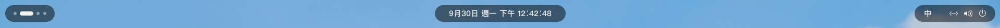
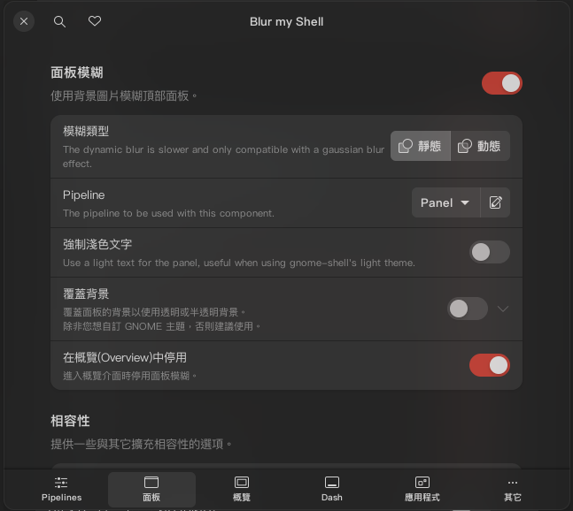
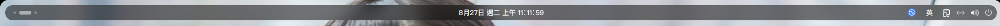
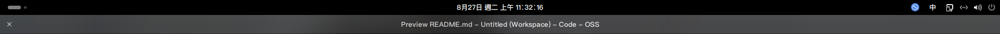

[繁體中文](README.md) | [English](README-en.md) 

# 动态顶部面板

最初灵感来源于 KDE Plasma 6 的悬浮面板的设计，在附近没有窗口时呈现半透明悬浮条效果，而当窗口靠近时则呈现实色面板的样式。支持 Gnome 的暗色模式和亮色模式切换。可针对暗色和亮色模式分别设定自定义颜色。还有更多设置！

## 悬浮模式

当顶部面板附近没有窗口时，会呈现悬浮模式。

**你可以任意组合各种样式，但不恰当的组合可能不会带来好的视觉效果。**

悬浮模式仅仅有半透明效果，没有模糊效果，目前如果想要模糊效果，建议搭配 Blur my shell 对面板的静态 pipeline 使用。Blur my shell 动态模式会没有圆角，这是 Blur my shell 的问题。
### Blur my shell 设置

使用静态效果，因为动态效果不支持圆角

记得在对应的 Pipeline 中添加「角落 (Corner)」效果，并根据你在此扩展功能中设置的圆角进行调整
### 搭配 Blur my shell 使用的效果

## 实体模式

当有任何窗口足够靠近（几乎接触）顶部面板时，顶部面板将会变为不透明的停靠栏（和 Gnome 默认的一样，但你可以对其应用自定义颜色），与最大化窗口可以更好的融合，而不像主题一样始终悬浮会有「漏光」的现象。

# 安装扩展功能
### 1. 从 Gnome Extensions 安装（推荐）
扩展功能链接：[https://extensions.gnome.org/extension/7284/dynamic-panel/](https://extensions.gnome.org/extension/7284/dynamic-panel/)
### 2. 从 GitHub 安装（不建议）
**不建议：Main 分支中可能处于正在开发下个版本的阶段，因此可能无法正常使用**

1. 选择 Tag 到最新或你想要的版本 Clone 或下载 Zip 到本地，或者你应该去 Release 下载
1. 解压缩所有文件到 `~/.local/share/gnome-shell/extensions/dynamic-panel@velhlkj.com/`
    * 目录不存在则自行创建即可。
    * 注意不要套娃！extension.js 应该直接在 `dynamic-panel@velhlkj.com` 中，而不是在 `dynamic-panel@velhlkj.com/dynamic-panel/` 中。
    * 路径是固定的，包括 `dynamic-panel@velhlkj.com` 也是，**不可以更改目录名**，否则扩展功能将不会显示在列表中，也无法生效。这是由于 Gnome 扩展功能要求目录名与 metadata.json 中指定的 uuid 保持一致的原因。
1. 重新启动 Gnome (Alt-F2 输入 r 回车) 或重新登录
1. 在 Gnome Extensions 中启用扩展功能

# 关于性能
由于 Gnome 自身的 css 和 gjs 的缘故，CSS3 的 transition 补间动画居然对大部分属性都是无效的！而 requestAnimationFrame 这个动画帧对齐函数也无法使用。因此不得不使用固定帧间隔的循环做逐帧动画来实现平滑移动、大小改变和圆角动画等，因此在 **动画过程中** 性能上会有一定影响。但在 **静止状态下不存在性能影响**。

# 关于翻译
* 除简体中文、繁体中文 (台湾)、英文由作者 (Velade) 维护外，其他翻译主要来源于其他贡献者。
* 因为完全不懂其他语言，当除上述语言以外的翻译有条目增加/变更时，作者将以 Gemini AI 进行翻译并补充/修改而不是留空。但无法保证翻译的准确性以及是否是最合适的选择。

# 翻译贡献者（排名不分先后）
* [Aleksandr Shamaraev](https://github.com/AlexanderShad) - 俄语 (Russian)
* [Amerey](https://github.com/Amereyeu) - 捷克语 (Czech)

# 特别鸣谢（排名不分先后）
* **感谢 Gonzague/Paul Fauchon 的 Transparent Top Bar (Adjustable transparency) 的思路，对窗口靠近的判定实现思路大量参考了此扩展功能**

* **感谢 Google Gemini 在研究和学习 Gjs 过程中提供的帮助**